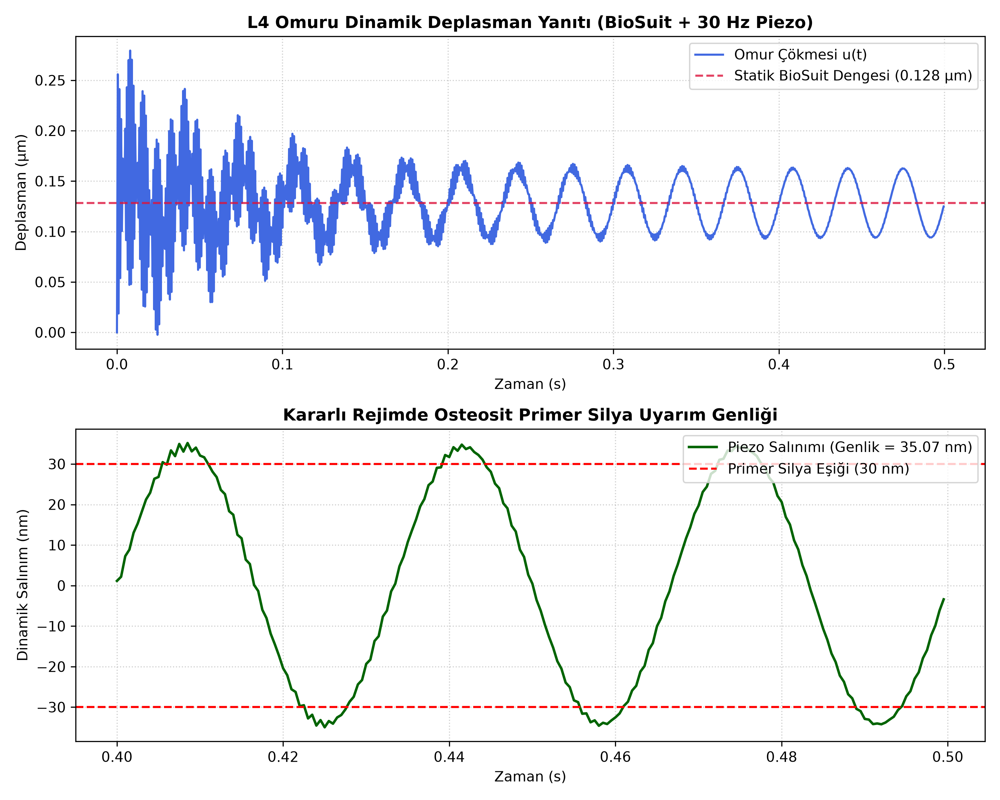

# 1-DOF Biomechanical Dynamic Simulation & Osteogenic Mechanotransduction Validation of L4 Lumbar Vertebra

[](https://opensource.org/licenses/MIT)
[](https://www.python.org/)

This repository contains an open-source, from-scratch numerical biomechanics implementation evaluating dynamic load transfer and cellular osteogenic stimulation on an isolated **L4 Lumbar Vertebra** derived from high-resolution clinical CT segmentation.

The primary objective is to investigate whether a wearable piezo-acoustic actuator coupled with mechanical countermeasure compression garments (e.g., MIT BioSuit concept) can reach the critical displacement threshold required to induce osteogenesis and counter microgravity-induced bone loss (spaceflight osteopenia/osteoporosis).

---

## Dynamic System Response & Threshold Verification



* **Top Panel:** Full time-history displacement response ($t = 0$ to $0.5\text{ s}$). The system transitions through transient viscoelastic damping ($C = 1697.98\text{ N}\cdot\text{s/m}$) and settles into the static equilibrium ($u_{\text{static}} = 0.128\ \mu\text{m}$) imposed by the $150\text{ N}$ static BioSuit preload.
* **Bottom Panel:** Steady-state dynamic response ($t = 0.4$ to $0.5\text{ s}$) driven by a $30\text{ Hz}$ piezo harmonic excitation. The resulting oscillation amplitude of **$35.07\text{ nm}$** successfully exceeds the **$30.00\text{ nm}$ primary cilia deflection threshold** with a **+16.9% safety margin**, confirming cellular mechanotransduction viability.

---

## Mathematical Formulation

The physical system is modeled as a direct single-degree-of-freedom (1-DOF) dynamic balance equation:

$$M \ddot{u}(t) + C \dot{u}(t) + K u(t) = F(t)$$

Where:
* $M = 0.685\text{ kg}$: Anatomical vertebral mass derived from cross-sectional cortical and cancellous densities.
* $K = 1169.27\text{ MN/m}$: Composite axial stiffness calculated via parallel spring model ($K = K_{\text{cortical}} + K_{\text{trabecular}}$).
* $C = 1697.98\text{ N}\cdot\text{s/m}$: Viscoelastic structural damping evaluated at Rayleigh damping ratio $\zeta = 0.02$.
* $f_n = 6575.87\text{ Hz}$: Structural natural frequency.

### Newmark-$\beta$ Time-Integration Scheme
To solve the equation of motion step-by-step without relying on commercial black-box solvers, the **average acceleration method** ($\beta = 0.25$, $\gamma = 0.50$, unconditionally stable) was implemented directly:

$$K_{\text{eff}} \cdot u_{i+1} = F_{\text{eff}}$$

$$K_{\text{eff}} = K + a_0 M + a_1 C$$

$$F_{\text{eff}} = F_{i+1} + M(a_0 u_i + a_2 \dot{u}_i + a_3 \ddot{u}_i) + C(a_1 u_i + a_4 \dot{u}_i + a_5 \ddot{u}_i)$$

Integration parameters ($\Delta t = 0.0005\text{ s}$):
* $a_0 = \frac{1}{\beta \Delta t^2}$, $a_1 = \frac{\gamma}{\beta \Delta t}$, $a_2 = \frac{1}{\beta \Delta t}$, $a_3 = \frac{1}{2\beta} - 1$, $a_4 = \frac{\gamma}{\beta} - 1$, $a_5 = \frac{\Delta t}{2}\left(\frac{\gamma}{\beta} - 2\right)$

---

## Biomechanical & Cellular Parameters

| Parameter | Value | Biological / Engineering Context |
| :--- | :--- | :--- |
| **Static Preload ($F_{\text{static}}$)** | $150.0\text{ N}$ | Mechanical counterpressure garment baseline |
| **Dynamic Force Amplitude ($F_0$)** | $40.0\text{ N}$ | Harmonic piezo actuator excitation |
| **Excitation Frequency ($f$)** | $30.0\text{ Hz}$ | Target anabolic frequency for osteocyte stimulation |
| **Primary Cilia Threshold** | $30.0\text{ nm}$ | Minimum deflection required for fluid flow / calcium signaling |
| **Simulated Dynamic Amplitude** | **$35.07\text{ nm}$** | **Target achieved (+16.9% Safety Margin)** |

---

## Usage

Clone the repository and run the self-contained solver:

```bash
git clone https://github.com/yoncabiranger/l4-vertebra-biomechanics-simulation.git
cd l4-vertebra-biomechanics-simulation
python tek_omur_analiz.py
